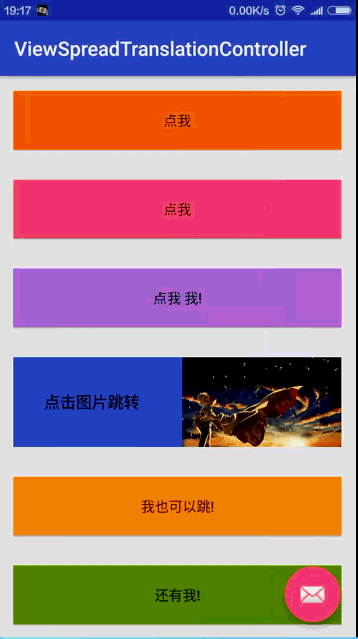
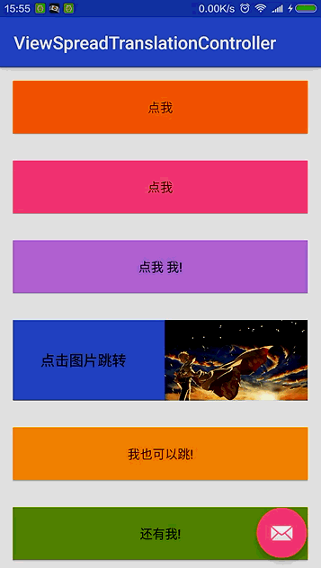
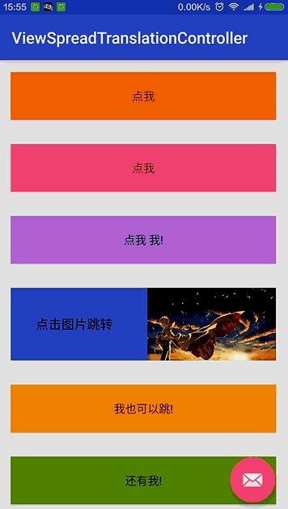

# ViewSpreadTranslationController
>###Android视图扩散切换控制器
>More simple  to create View Translation Animation.
>API compatible with **Android 4.0+**

#Preview
---







---
#Usage 
#java

```
 helper = new BaseViewHelper
                .Builder(SecondActivity.this)
                //.setEndView()//如果是两个切换的视图  这里设定最终显示的视图
                .setTranslationView(v)//设置过渡视图
                .isFullWindow(true)//是否全屏显示
                .isShowTransition(true)//是否显示过渡动画
                .setDimColor(Color.WHITE)//遮罩颜色
                .setDimAlpha(200)//遮罩透明度
                //.setTranslationX(0)//x轴平移
                //.setRotation(360)//旋转
                //.setScaleX(0)//x轴缩放
                //.setScaleY(0)//y轴缩放
                //.setTranslationY(0)//y轴平移
                //.setDuration(800)//过渡时长
                //.setInterpolator(new AccelerateDecelerateInterpolator())//设置插值器
                //设置监听
//                .setOnAnimationListener(new BaseViewHelper.OnAnimationListener() {
//                    @Override
//                    public void onAnimationStartIn() {
//                        Log.e("TAG","onAnimationStartIn");
//                    }
//
//                    @Override
//                    public void onAnimationEndIn() {
//                        Log.e("TAG","onAnimationEndIn");
//                    }
//
//                    @Override
//                    public void onAnimationStartOut() {
//                        Log.e("TAG","onAnimationStartOut");
//                    }
//
//                    @Override
//                    public void onAnimationEndOut() {
//                        Log.e("TAG","onAnimationEndOut");
//                    }
//                })
                .create();//开始动画

```
#More use 
---
**A(Activity) -->B(Activity) **
A(Activity):
```
 new BaseViewHelper
                .Builder(MainActivity.this, view)
                .startActivity(intent);
```
B(Activity):
```
helper = new BaseViewHelper
                .Builder(SecondActivity.this)
                .isFullWindow(true)//是否全屏显示
                .isShowTransition(true)//是否显示过渡动画
                .setDimColor(Color.WHITE)//遮罩颜色
                .setDimAlpha(200)//遮罩透明度
                .create();//开始动画

    @Override
    public void onBackPressed() {
        if (helper!=null && helper.isShowing()){
            helper.backActivity(this);
        }else {
            super.onBackPressed();
        }
    }
```
---
**A(View) -->B(View) **
**Activity:**
```
            View v = View.inflate(this,R.layout.layout_second,null);
            //显示在当前页面跳转
            helper = new BaseViewHelper.Builder(this,view)
                    .setEndView(v)
                    .create();


    @Override
    public void onBackPressed() {
        if (helper!=null && helper.isShowing()){
            helper.back();
        }else {
            super.onBackPressed();
        }
    }
```


###About me
---
An Android Developer in ZhengZhou.

【[**我的简书地址**](http://www.jianshu.com/users/3c751e06dc32/latest_articles)】

【[**我的CSDN地址**](http://blog.csdn.net/zhangke3016)】

=======


###License
=======
Copyright  2016  zhangke

Licensed under the Apache License, Version 2.0 (the "License");
you may not use this file except in compliance with the License.
You may obtain a copy of the License at 
http://www.apache.org/licenses/LICENSE-2.0
Unless required by applicable law or agreed to in writing, software
distributed under the License is distributed on an "AS IS" BASIS,
WITHOUT WARRANTIES OR CONDITIONS OF ANY KIND, either express or implied.
See the License for the specific language governing permissions and
limitations under the License.
